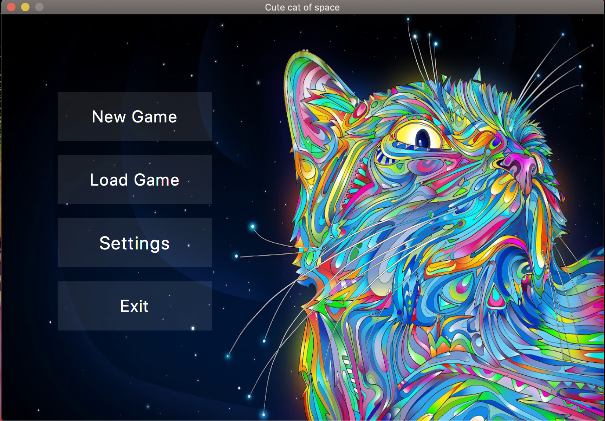
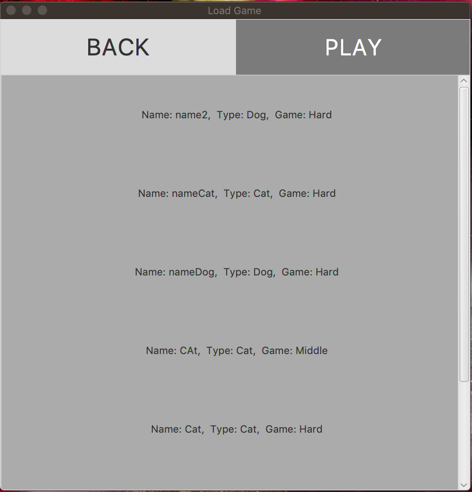
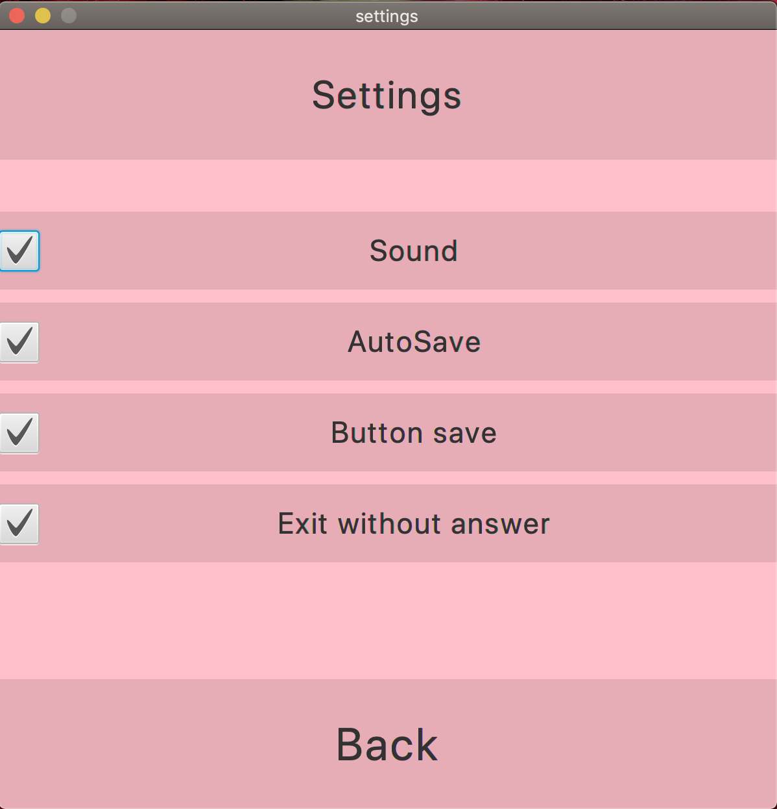
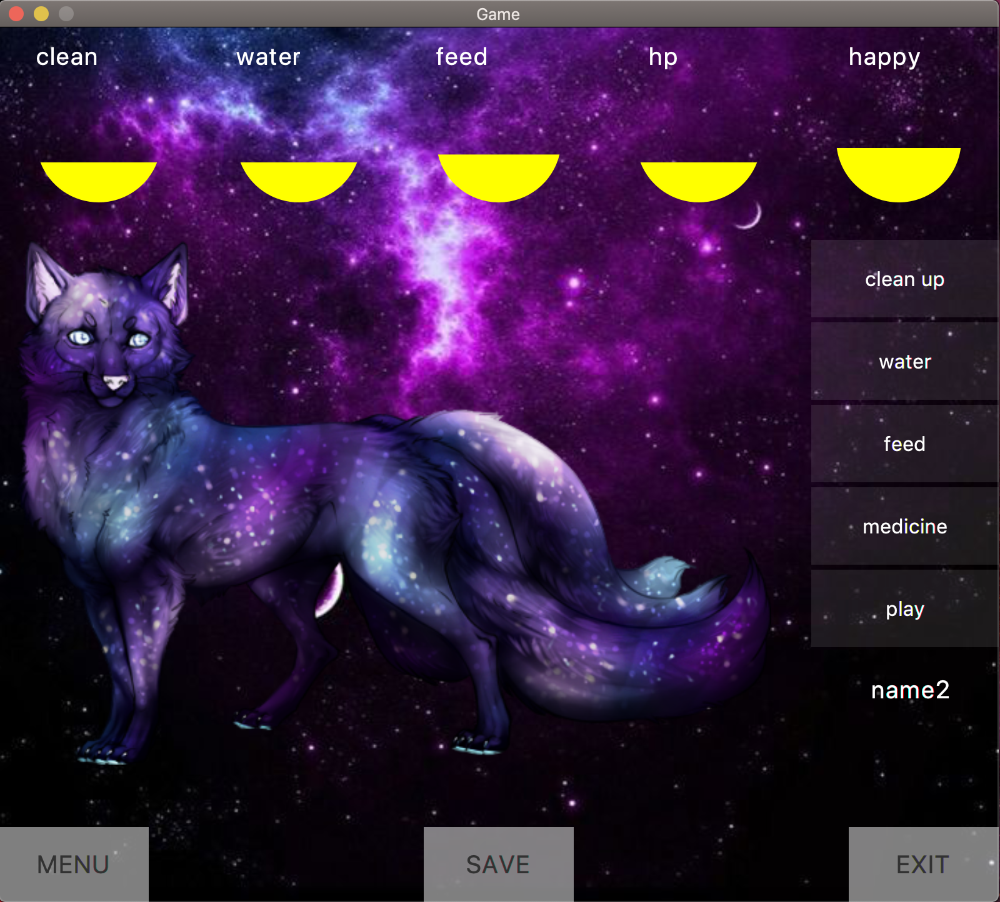
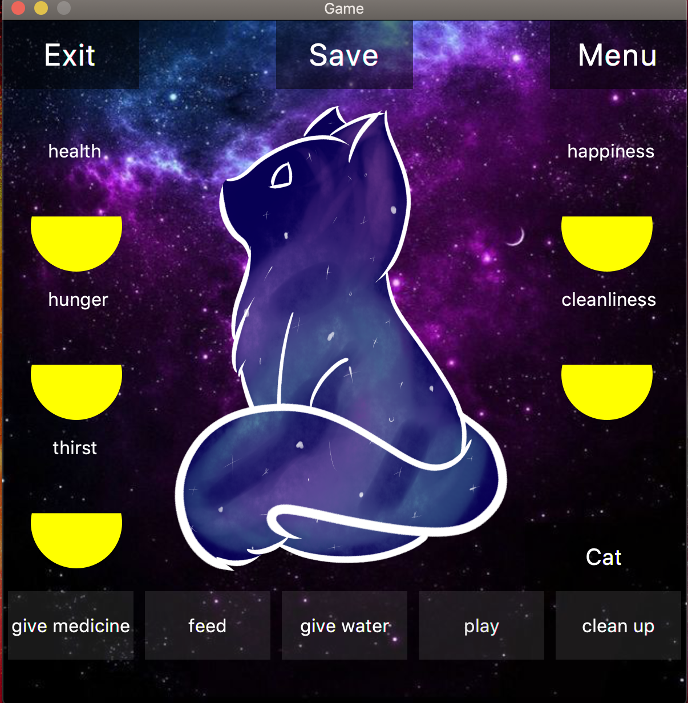
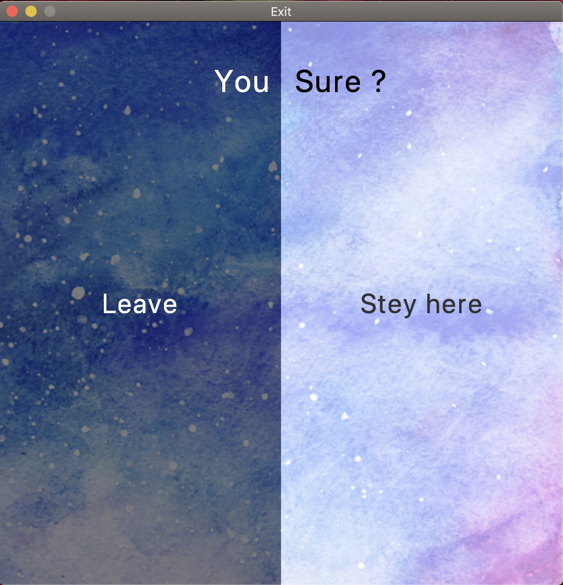

## tamagotchi

Little project of learning in Ucode IT Academy

### install 

---

**Mac Os**

You must have on your Mac

* java       15
* maven      4.0

> git clone
>
> cd tamagotchi
>
> mvn javafx:run

### Game Play

--- 

**Screens**

--

--

--

--

---

--

### Technologies

---

* java 15
* javaFX
* sqlite
* maven
